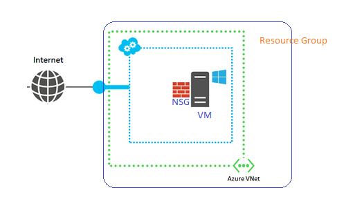

# IAC
IAC using Azure - PowerShell functions. Compose as you like to create an Infrastruture on the CLOUD!

1. InfraCreation.ps1 - Contains PowerShell Functions needed to create your Infrastrucure on the AZURE CLOUD!
   * Open this file in Powershell in Administrator mode and EXECUTE it. This will create all the functions and keep it ready 
     for the opened session.

2. Simple1VMEnvironment.ps1 - Create a simple VM environment

   

3. Projet1_STAGEEnvironment.ps1  - Sample file contains an Infrastructure with 1 Virtual Network, 2 SubNets, 2 VM's with IIS,
   1 SQL Server.

   Note: 2 Login prompts will be prompted.
   
         1. Login to Azure with your credentials
         2. Login Information for the VM's
   
4. InfraDiagram - Diagram of the sample.

   
   
